# Дипломная работа профессии Системный администратор 
##ссылки на ресурсы**  
[Исходное задание ](https://github.com/netology-code/sys-diplom/tree/diplom-zabbix?tab=readme-ov-file)  

## 1. Terraform
### Конфигурационные файлы:
- variables.tf - файл с переменными инраструктуры terraform
  критичные реквизиты подключения к облаку берутся из системных переменных
  variable "yandex_cloud_token" {}
  variable "yandex_cloud_id" {}
  variable "yandex_folder_id" {}

- providers.tf -  файл с описанием используемого провайдера и его реквизитами;
- resources.tf - основной файл с описанием всех создаваемых ресурсов облака, файл последовательно описывает:
    - Сеть
    - Подсети
    - Инраструктуру балансировщика и балансировщик
    - Описание групп безопасности
    - Web сервер 1
    - web сервер 2
    - Бастионный хост
    - Zаbbix сервер
    - Сервер Elasticsearch
    - Сервер Kibana
    - Параметры снимков для дисков виртуальных машин 
- output.tf - файл с описанием созданных внешних адресов инфраструктуры;

## 2. Созданная инфраструктура после применения конфигурационных файлов terraform  

### 2.1 Сетевая инфраструктура
**Сеть**
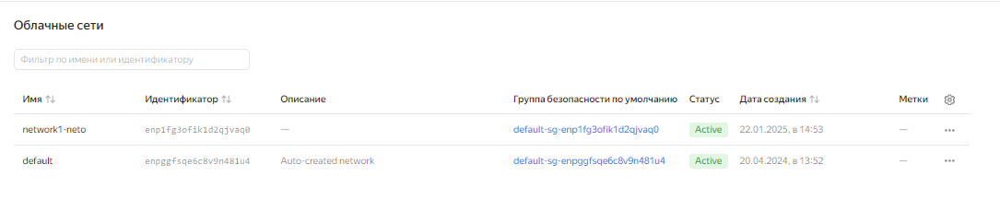
**Подсети**
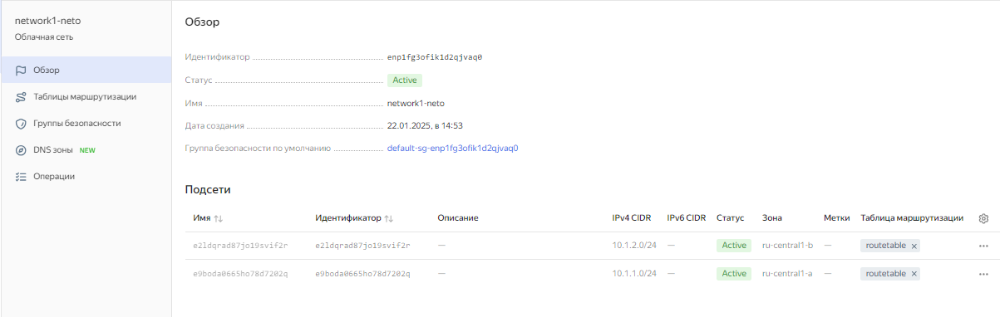
**Карта сети**
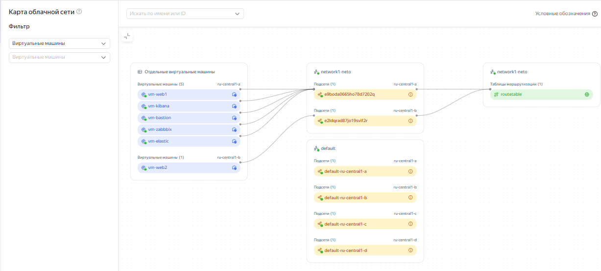
**публичные пдреса**
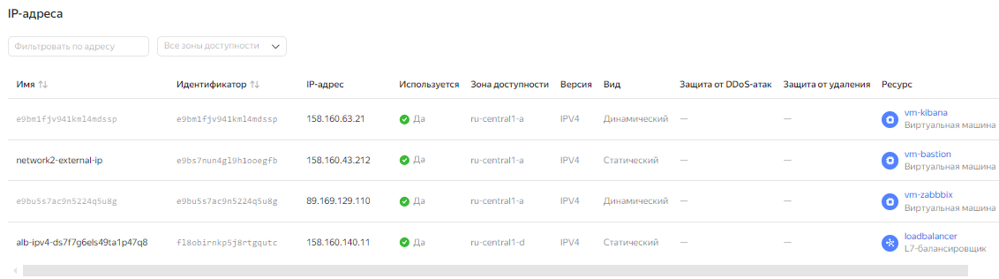
**Маршрутизация и шлюз**
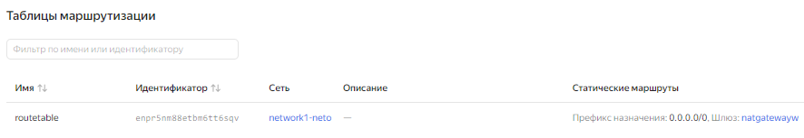
**Группы безопасности**
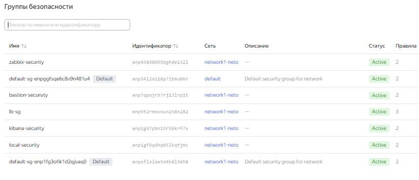

### 2.2 Балансировщик
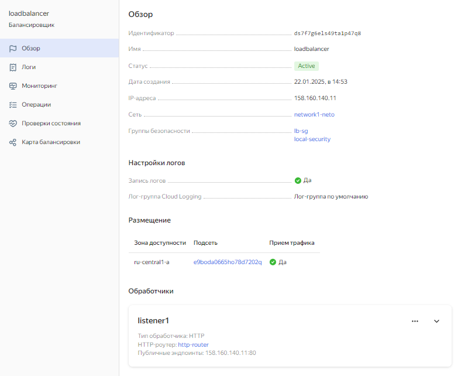
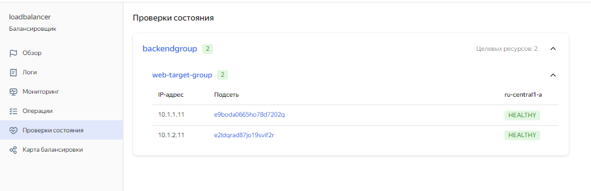
**Карта балансировки**
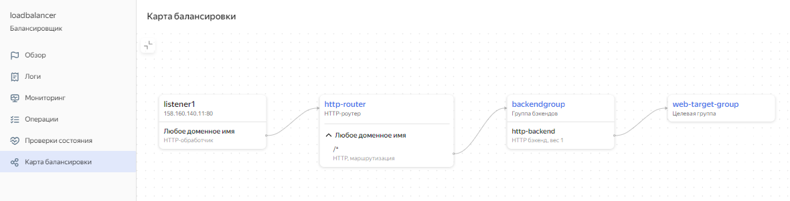
**router**
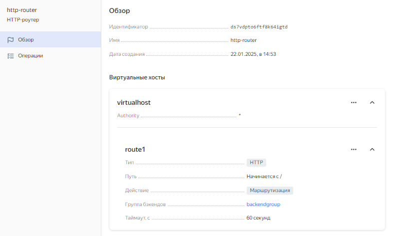
**backend group**
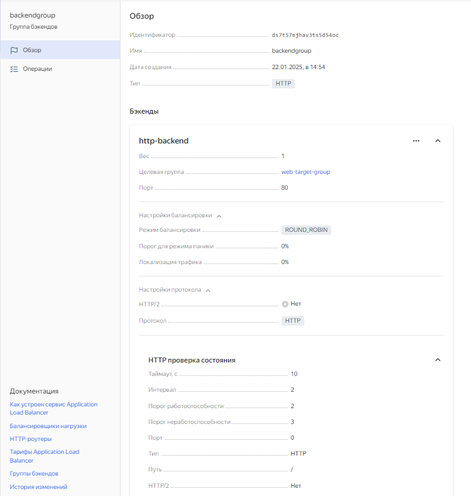
**target group**
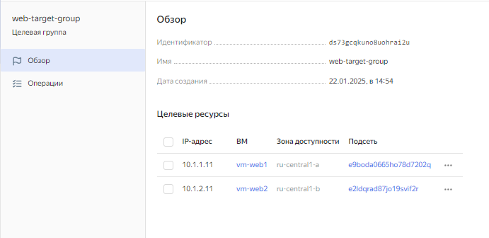

### 2.3 Группы безопасности (правила хождения трафика)


**Основная локальная группа**
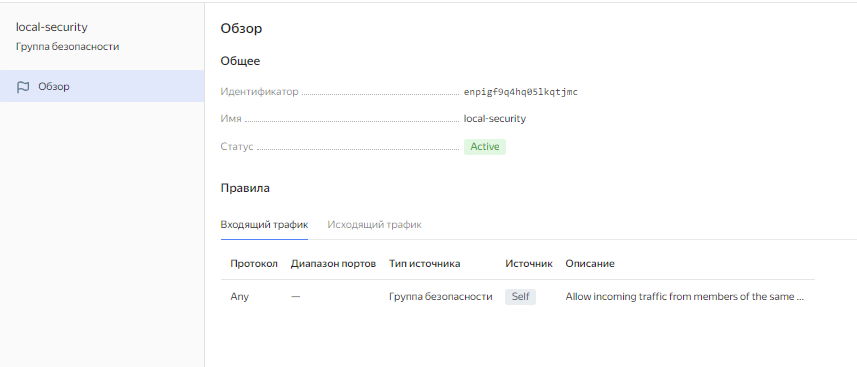
**Группа безопасноти для балансировщика**
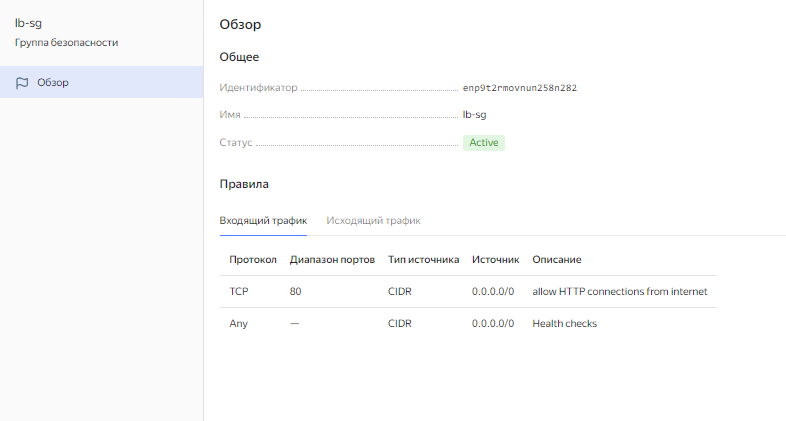
**Группа безопасности для бастионного хоста**
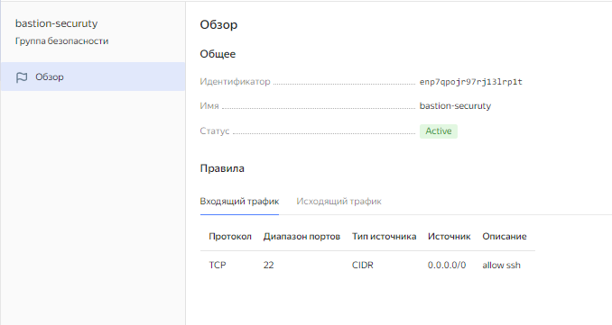
**Группа безопасности для сервера заббикса**
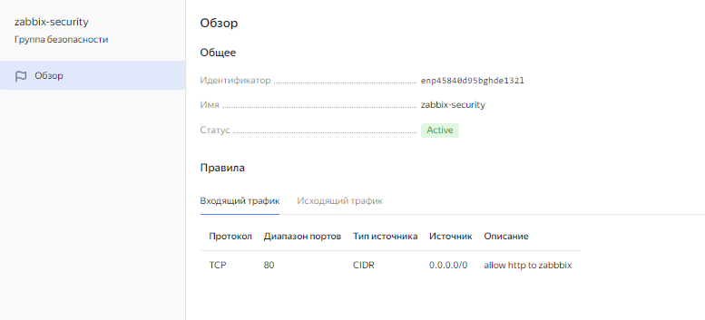
**Группа безопасности для сервера kibana**
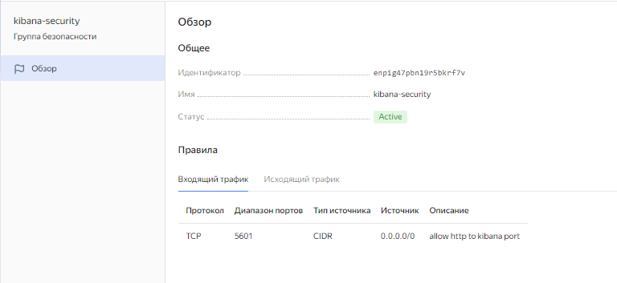

### 2.4 Виртуальные машины на базе Ubuntu 22

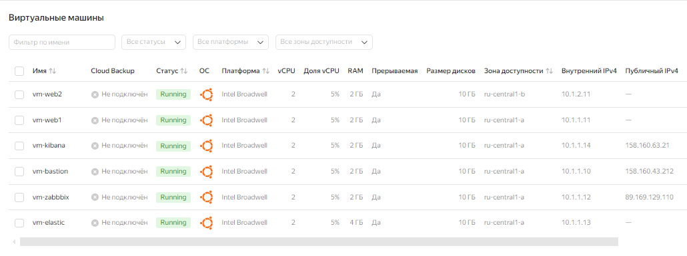

### 2.5 Snapshots


## 3. Ansible
### Состав файлов конфигураций:
- hosts - группы виртаульных машин для деплоя и параметры подключения ssh через бастионных хост
- playbook1.yml - первый плейбук для установки:
    - Web server в составе: 
      - Nginx
      - zabbix-agent
      - filebeat
    - Zabbix server в составе:
      - postgresql
      - postgresql-contrib
      - apache2
      - zabbix-server-pgsql 
      - zabbix-frontend-php 
      - php8.1-pgsql 
      - zabbix-apache-conf 
      - zabbix-sql-scripts 
      - zabbix-agent
    - Elasticsearch server в составе:
      - Elasticsearch
- Playbook2.yml - второй плейбук для установки:
    - Kibana server в составе:
      - Kibana
    - filebeat сервис на web servers 1 и 2 

## 4. Результаты выполненния плейбуков Ansible
###  playbook1.yml

```
PLAY [Deploing web srv] **********************************************************************************************************************************************

TASK [Install nginx] *************************************************************************************************************************************************
changed: [websrv1.ru-central1.internal]

TASK [Copy site file] ************************************************************************************************************************************************
changed: [websrv1.ru-central1.internal]

TASK [Restart nginx] *************************************************************************************************************************************************
changed: [websrv1.ru-central1.internal]

TASK [Install zabbix repo from the internet] *************************************************************************************************************************
changed: [websrv1.ru-central1.internal]

TASK [refresh cache] *************************************************************************************************************************************************
changed: [websrv1.ru-central1.internal]

TASK [install zabbix-agent] ******************************************************************************************************************************************
changed: [websrv1.ru-central1.internal]

TASK [Edit zabbix_agent.conf] ****************************************************************************************************************************************
[WARNING]: Consider using the replace, lineinfile or template module rather than running 'sed'.  If you need to use command because replace, lineinfile or template
is insufficient you can add 'warn: false' to this command task or set 'command_warnings=False' in ansible.cfg to get rid of this message.
changed: [websrv1.ru-central1.internal]

TASK [Restart zabix service] *****************************************************************************************************************************************
changed: [websrv1.ru-central1.internal]

TASK [Install nginx] *************************************************************************************************************************************************
changed: [websrv2.ru-central1.internal]

TASK [Copy site file] ************************************************************************************************************************************************
changed: [websrv2.ru-central1.internal]

TASK [Restart nginx] *************************************************************************************************************************************************
changed: [websrv2.ru-central1.internal]

TASK [Install zabbix repo from the internet] *************************************************************************************************************************
changed: [websrv2.ru-central1.internal]

TASK [refresh cache] *************************************************************************************************************************************************
changed: [websrv2.ru-central1.internal]

TASK [install zabbix-agent] ******************************************************************************************************************************************
changed: [websrv2.ru-central1.internal]

TASK [Edit zabbix_agent.conf] ****************************************************************************************************************************************
[WARNING]: Consider using the replace, lineinfile or template module rather than running 'sed'.  If you need to use command because replace, lineinfile or template
is insufficient you can add 'warn: false' to this command task or set 'command_warnings=False' in ansible.cfg to get rid of this message.
changed: [websrv2.ru-central1.internal]

TASK [Restart zabix service] *****************************************************************************************************************************************
changed: [websrv2.ru-central1.internal]

PLAY [Deploing zabbix srv] *******************************************************************************************************************************************

TASK [Install zabbix repo from the internet] *************************************************************************************************************************
changed: [zabbix.ru-central1.internal]

TASK [refresh cache] *************************************************************************************************************************************************
changed: [zabbix.ru-central1.internal]

TASK [install all for Zabbix] ****************************************************************************************************************************************
changed: [zabbix.ru-central1.internal]

TASK [create db] *****************************************************************************************************************************************************
[WARNING]: Consider using 'become', 'become_method', and 'become_user' rather than running su
changed: [zabbix.ru-central1.internal]

TASK [pass zabbix_server.conf] ***************************************************************************************************************************************
changed: [zabbix.ru-central1.internal]

TASK [Restart zabsrv service] ****************************************************************************************************************************************
changed: [zabbix.ru-central1.internal]

TASK [Restart apache service] ****************************************************************************************************************************************
changed: [zabbix.ru-central1.internal]

PLAY [deploing Elastic srv] ******************************************************************************************************************************************

TASK [install elasticsearch from internet] ***************************************************************************************************************************
changed: [elastic.ru-central1.internal]

TASK [Copy elasticsearch conf] ***************************************************************************************************************************************
changed: [elastic.ru-central1.internal]

TASK [restart elasticsearch] *****************************************************************************************************************************************
changed: [elastic.ru-central1.internal]

PLAY RECAP ***********************************************************************************************************************************************************
elastic.ru-central1.internal : ok=3    changed=3    unreachable=0    failed=0    skipped=0    rescued=0    ignored=0   
websrv1.ru-central1.internal : ok=8    changed=8    unreachable=0    failed=0    skipped=0    rescued=0    ignored=0   
websrv2.ru-central1.internal : ok=8    changed=8    unreachable=0    failed=0    skipped=0    rescued=0    ignored=0   
zabbix.ru-central1.internal : ok=7    changed=7    unreachable=0    failed=0    skipped=0    rescued=0    ignored=0  
```

### playbook2.yml

```
PLAY [deploing kibana srv] *******************************************************************************************************************************************

TASK [inatall kibana from internet] **********************************************************************************************************************************
changed: [kibana.ru-central1.internal]

TASK [Copy kibana conf] **********************************************************************************************************************************************
changed: [kibana.ru-central1.internal]

TASK [restart kibana] ************************************************************************************************************************************************
changed: [kibana.ru-central1.internal]

PLAY [deploing Filebeat srv] *****************************************************************************************************************************************

TASK [install filebeat from internet] ********************************************************************************************************************************
changed: [websrv1.ru-central1.internal]
changed: [websrv2.ru-central1.internal]

TASK [Copy filebeatconf] *********************************************************************************************************************************************
changed: [websrv1.ru-central1.internal]
changed: [websrv2.ru-central1.internal]

TASK [enable module nginx] *******************************************************************************************************************************************
changed: [websrv2.ru-central1.internal]
changed: [websrv1.ru-central1.internal]

TASK [Copy filebeat ngix conf] ***************************************************************************************************************************************
changed: [websrv2.ru-central1.internal]
changed: [websrv1.ru-central1.internal]

TASK [restart filebeat] **********************************************************************************************************************************************
changed: [websrv2.ru-central1.internal]
changed: [websrv1.ru-central1.internal]

PLAY RECAP ***********************************************************************************************************************************************************
kibana.ru-central1.internal : ok=3    changed=3    unreachable=0    failed=0    skipped=0    rescued=0    ignored=0   
websrv1.ru-central1.internal : ok=5    changed=5    unreachable=0    failed=0    skipped=0    rescued=0    ignored=0   
websrv2.ru-central1.internal : ok=5    changed=5    unreachable=0    failed=0    skipped=0    rescued=0    ignored=0   
```

## 5. Итоговые Web интерфейсы 

### 5.1 Web страница за банасировщиком
**Подключения браузера к странице**


### 5.2 Zabbix monitoring
**Дашборд с параметрами монитоиинга web серверов**
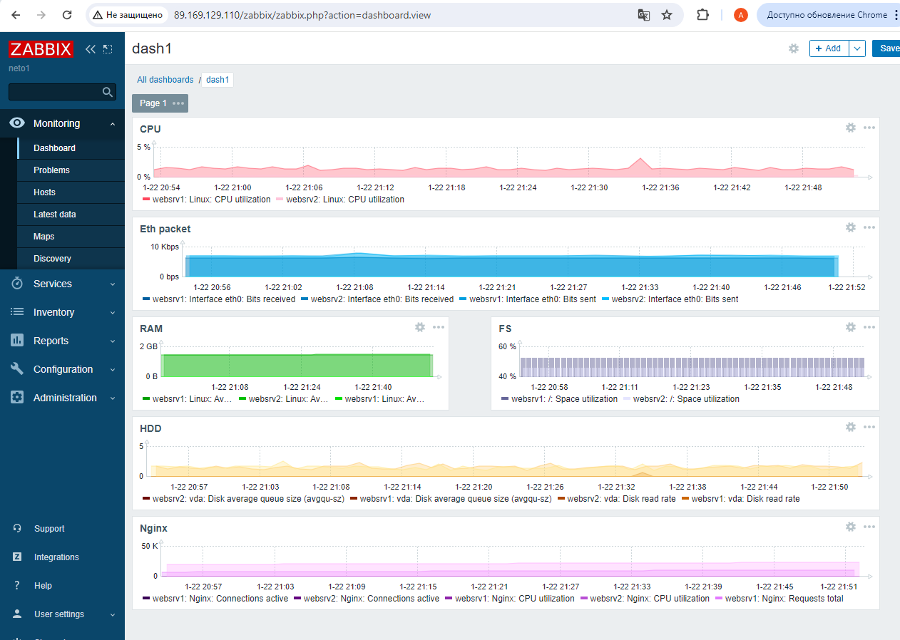
**Мониторинг серверов**
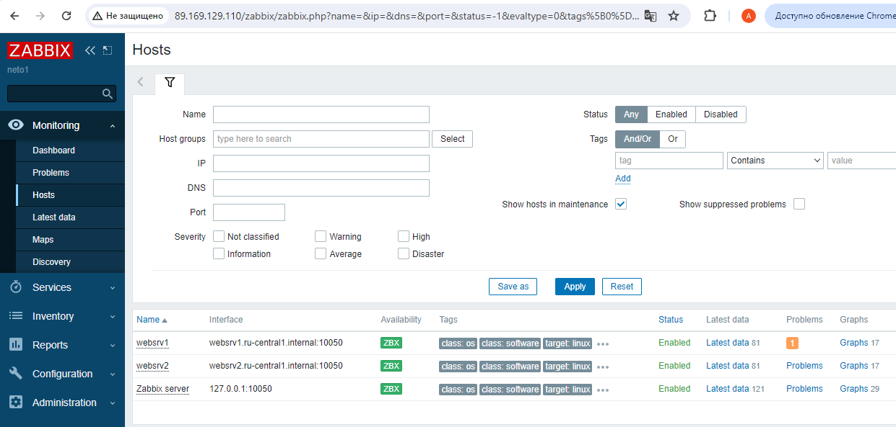
**Сработка триггера на treshold**
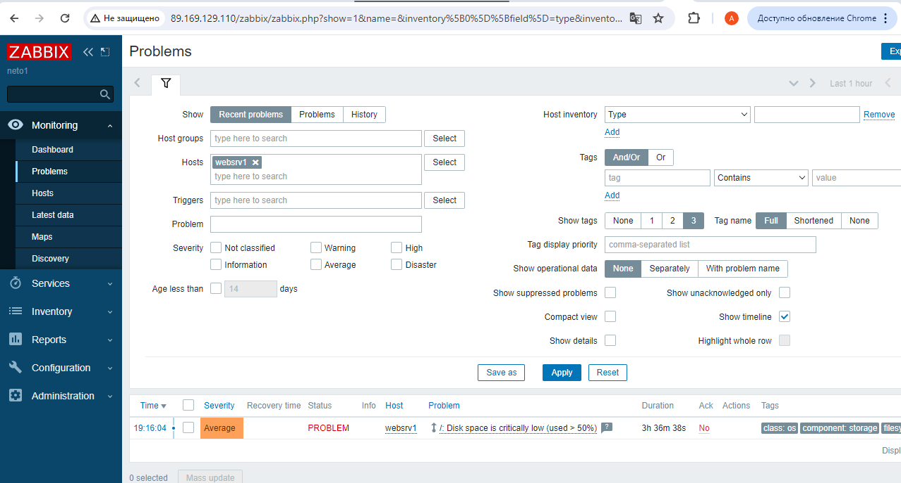
**Подключение хостов по FQDN и используемые шаблоны**
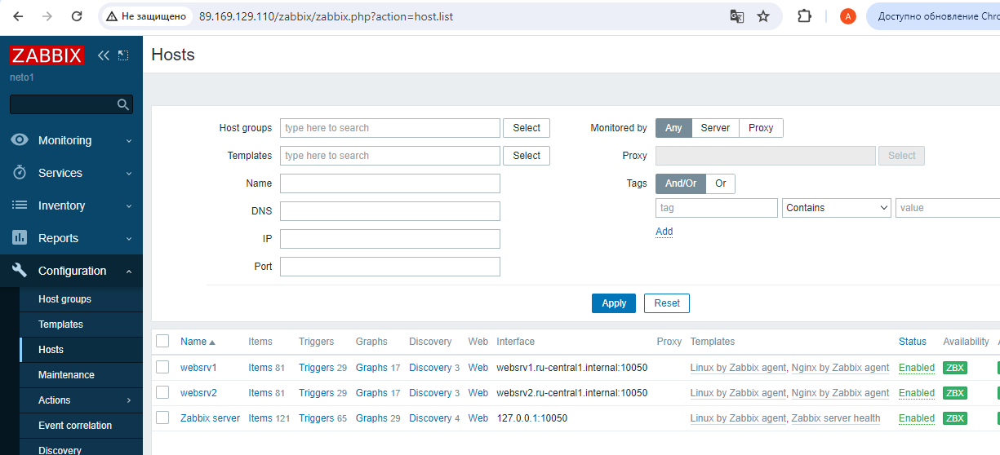

### 5.3 Kibana 
**Подключения браузера к странице за nginx в access.log**
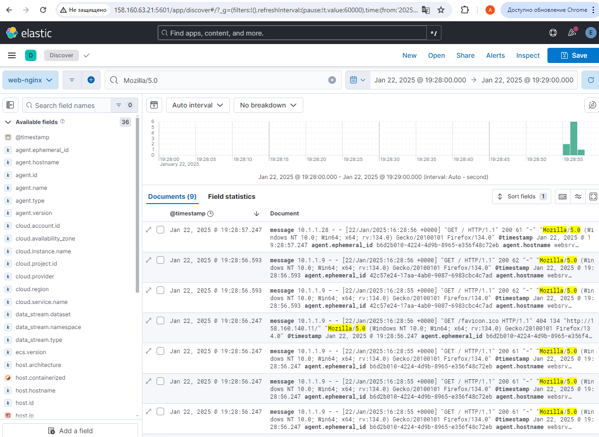
**Подключения балансировщика к nginx в access.log**
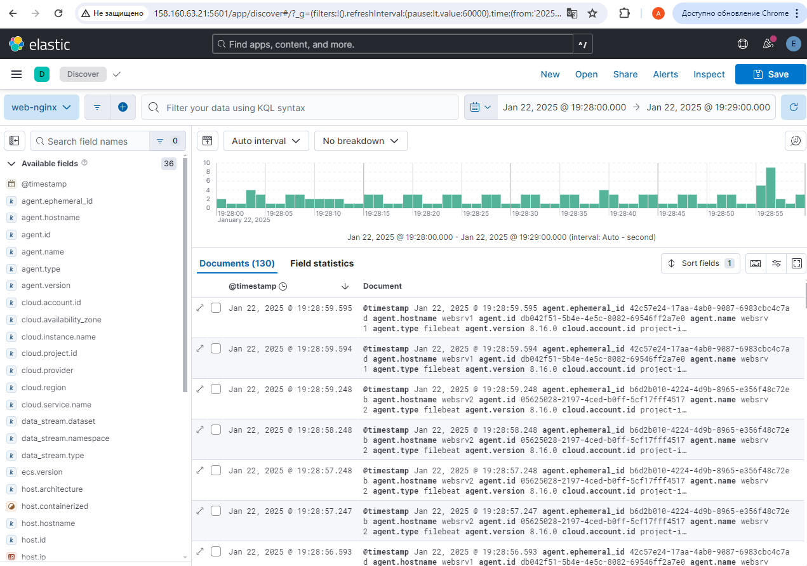
